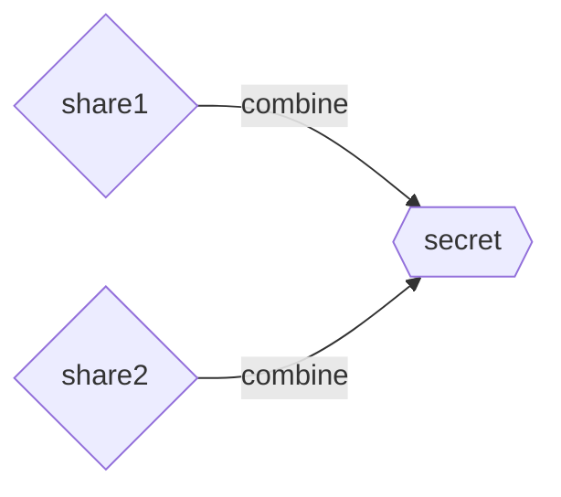

# Gaps found from Oxide RFD corpus audit

Audit date: 2026-02-21. Sampled ~13 RFDs across the full range
(0001–0642) from the Oxide `rfd/rfd/` repository and compared against
`asciidoc-format.md`, `design.md`, and the implementation plan.

## Real gaps (used in practice, not documented or planned)

### 1. Backtick-fenced code blocks (` ``` `)

**Seen in:** RFD 0301 (Mermaid diagrams)

Asciidoctor supports Markdown-style triple-backtick fenced code blocks
as an alternative to `----` listing blocks. An optional language hint
follows the opening fence:

````

````

These are equivalent to `[source,lang]` + `----` blocks. Not mentioned
anywhere in `asciidoc-format.md` or the implementation plan. The parser
needs to recognize these as leaf blocks.

**Decision needed:** normalize to AsciiDoc-native `----` blocks, or
preserve the backtick syntax?

### 2. Two-argument anchor form `[[id, reftext]]`

**Seen in:** RFD 0025 (glossary, ~30 occurrences)

```
[[g-bbu, BBU]]
```

The second argument sets the cross-reference display text — so
`<<g-bbu>>` renders as "BBU" without needing `<<g-bbu,BBU>>` at every
call site. Our docs only show the single-argument form `[[anchor-id]]`.
The parser needs to accept the comma-separated reftext.

### 3. Custom block styles beyond standard admonitions

**Seen in:** RFD 0400

```
[EXERCISE]
====
...
====
```

Our docs list the 5 standard admonitions (NOTE, TIP, IMPORTANT,
CAUTION, WARNING) but don't mention that arbitrary uppercase names are
valid. Asciidoctor treats unknown names as custom admonitions (or just
styled blocks). The parser should preserve these as opaque attributed
blocks rather than rejecting them.

## Partially covered (more complex than documented)

### 4. Complex combined table cell prefixes

**Seen in:** RFDs 0025, 0100, 0499

```
.2+^.^h|Distribution Option
4+^h|Fraction of Design Load
```

Individual pieces (span, alignment, header flag) are each documented,
but the full combinatorial syntax isn't shown. Real-world RFDs freely
combine row span (`.N+`), column span (`N+`), horizontal alignment
(`<`, `^`, `>`), vertical alignment (`.<`, `.^`, `.>`), content style
(`a`, `h`, `m`, etc.), all on a single cell. The table parser needs to
handle the full prefix grammar, not just individual features.

### 5. `[.role]#text#` — inline role on mark formatting

**Seen in:** RFD 0250

```
[.line-through]#Dark Lord on his dark throne#
```

Our docs mention role/style attributes on inline formatting generically
(`[red]*bold*`) but don't show the `#` (mark/highlight) form with a
role attribute. This is the most common way to apply CSS classes to
arbitrary inline text.

### 6. Attribute substitution in author line position

**Seen in:** RFDs 0250, 0400, 0499, 0567

```
:authors: Rain Paharia <rain@oxide.computer>

= RFD 400 Title
{authors}
```

The author line uses an attribute reference instead of a literal name.
The header parser needs to handle `{attribute}` references in the
author position, or at minimum not choke on them.

## Not a gap (investigated and dismissed)

- **`---` as separator** (RFD 0567): Not a thematic break in AsciiDoc.
  Asciidoctor treats `---` on its own line as an em dash replacement,
  not as `'''`. This is a Markdown-ism that happens to render as a
  separator in some contexts.

- **`%collapsible` option** (RFD 0400): Already covered by the `%option`
  syntax in block attribute shorthand (`[#id.role%option]`).

- **`[quote, attribution]` on paragraphs** (RFD 0301): Already
  documented and planned in Task 12b.

- **`+text+` inline passthrough in bibliography entries** (RFD 0025):
  Already planned in Task 16.

- **Tables with `a` (AsciiDoc) content type** (RFDs 0025, 0100):
  Already documented in the column specification section and planned
  in Task 18.

- **`{authors}` / `{state}` attribute references in attribute values**
  (all RFDs): Normal attribute substitution behavior, already implied
  by the attribute system.

## Corpus characteristics

The RFD corpus is primarily long-form technical prose. The most complex
constructs are:

- **Tables**: heavily used, often with column spans, row spans, header
  flags, and `a`-type cells containing nested lists. RFD 0025 is a
  good stress test.
- **Source blocks**: `[source,rust]` is extremely common, often with
  list continuation (`+`) to attach code blocks to list items.
  RFD 0400 has dozens of these.
- **Bibliography sections**: `[bibliography]` with `[[[ref]]]` entries
  appear in most RFDs. The two-argument anchor form is used throughout
  RFD 0025's glossary.
- **Cross-references**: `<<ref>>` and `<<ref,text>>` are the primary
  linking mechanism between RFDs.
- **Admonitions**: all 5 standard types appear, both paragraph and
  block form. RFD 0400 also uses `[TIP]`, `[NOTE]`, and a custom
  `[EXERCISE]` block.
- **Footnotes**: RFD 0400 uses `footnote:[...]` extensively, including
  very long multi-sentence footnotes.

No instances found of: `ifdef`/`ifndef`/`ifeval`, `include::`,
`kbd:[]`, `btn:[]`, `menu:[]`, `icon:[]`, index terms, counters,
stem/math notation, or nested tables.
